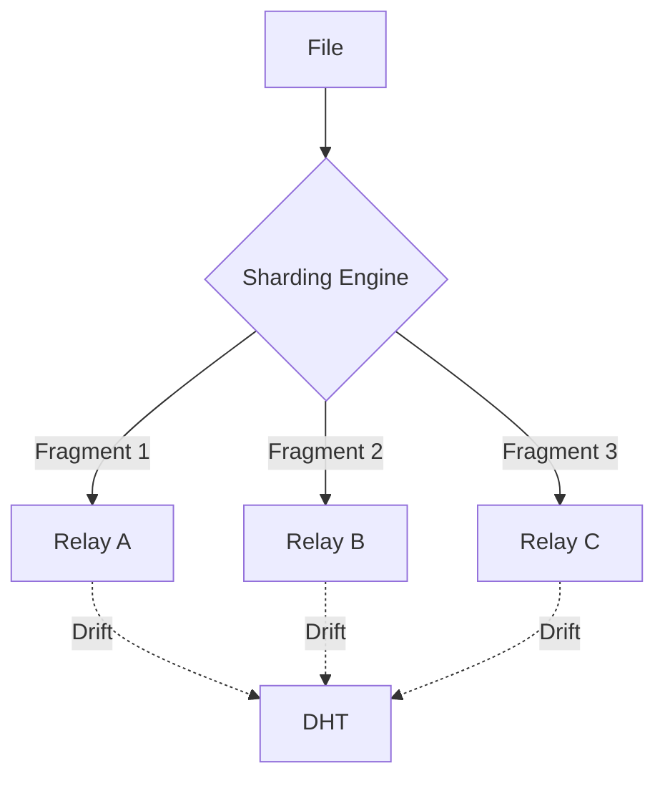

# ⬡ Polygone-Drive

**Decentralized, Post-Quantum, and Ephemeral Storage.**

Polygone-Drive is a sharded storage engine built on top of the Polygone protocol. It "vaporizes" your files into small, encrypted fragments (ML-KEM shards) that drift through a distributed DHT.

## 🚀 Key Features

- **Vapor Streaming™**: Start playing videos or audio files instantly. The engine fetches and reconstructs shards in a "sliding window" buffer while you watch.
- **Vapor Links (Public Sharing)**: Share files without sending physical map files. Generate a `poly://` link that contains the ephemeral reconstruction keys.
- **Metadata Invisible**: Files are split using Shamir Secret Sharing. No single relay node knows if it's holding a piece of a PDF, an image, or a simple text.
- **Post-Quantum Secure**: All shards are protected by FIPS 203 (ML-KEM) and FIPS 204 (ML-DSA) primitives.

## 🛠️ Usage

### Upload a file
```bash
polygone-drive upload my_secret_data.pdf --recipient public.key
```

### Share with a Vapor Link
```bash
polygone-drive share my_secret_data.pdf.pgd
# Output: poly://<base64_token>
```

### Stream/Download
```bash
polygone-drive download --token poly://<token> --sk my_private.key
```

## 🏗️ Architecture



## ⚖️ License
MIT License - 2026 Lévy / Polygone Ecosystem.
by Hope
